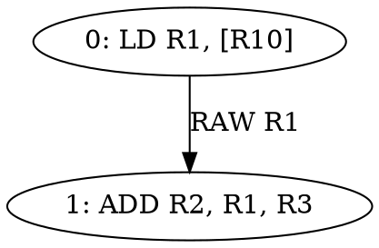

# GPU-Oriented Instruction Scheduling Simulator

This is a standalone C++17 simulator for a simplified GPU-like SIMT execution
model. It parses small instruction streams, builds compiler-style dependency
graphs, schedules instructions with list-scheduling heuristics, then simulates
cycle-level execution to measure stalls, IPC, and throughput improvement.

The project is intentionally not a real NVIDIA or AMD ISA simulator. It is a
small backend-compiler scheduling project that connects dependency analysis,
latency-aware scheduling, pipeline hazards, warp execution, and reproducible
before/after metrics.

## Architecture Model

- SIMT execution uses warps with configurable warp size, active mask, PC,
  per-register ready cycles, issued/completed counts, and stall counters.
- The default config models one SM, 32-lane warps, up to 8 resident warps, and
  global issue width 1.
- The simplified pipeline is Fetch, Decode, Issue, Execute, Writeback. The
  simulator focuses on the Issue stage because that is where dependency and
  structural stalls are visible.
- Execution units are modeled separately: `INT`, `FP`, `MEM`, `SFU`, `BRANCH`,
  and `NONE`, each with configurable per-cycle capacity.
- Supported hazards are RAW, WAR, WAW, conservative memory ordering, barrier
  ordering, control boundaries, structural hazards, and scoreboard-style
  register readiness stalls.

## Instruction Format

Assembly input:

```asm
kernel vector_add
warp 0

LD R1, [R10]
LD R2, [R11]
ADD R3, R1, R2
MUL R4, R3, R5
ST [R12], R4
END
```

JSON IR input is also supported:

```json
{
  "kernel": "vector_add",
  "warps": [
    {
      "id": 0,
      "instructions": [
        { "opcode": "LD", "dst": "R1", "srcs": ["R10"], "unit": "MEM" },
        { "opcode": "ADD", "dst": "R2", "srcs": ["R1", "R3"], "unit": "INT" }
      ]
    }
  ]
}
```

Supported opcodes are `ADD`, `MUL`, `FMA`, `LD`, `ST`, `SFU`, `BRA`, `BAR`, and
`NOP`.

## Scheduling Algorithms

- `baseline`: preserves original instruction order.
- `list`: topological list scheduler with original program order as the
  tie-breaker.
- `latency-aware`: prioritizes `critical_path + instruction_latency +
  successor_count`.
- `stall-fill`: prefers ready-list instructions whose operands are available in
  the scheduler's simple readiness model, then critical path, latency,
  successor count, and original order.

Every scheduled block is validated as a topological ordering of its dependency
graph before simulation.

## Build and Test

```powershell
cmake -S . -B build
cmake --build build --config Debug
ctest --test-dir build -C Debug --output-on-failure
```

The build creates:

- `build/Debug/gpu_sched_sim.exe`
- `build/Debug/gpu_sched_sim_tests.exe`
- CMake target `check-gpu-sched-sim`

## CLI

```powershell
.\build\Debug\gpu_sched_sim.exe `
  --input examples\memory_latency.asm `
  --scheduler stall-fill `
  --config configs\default_gpu.json `
  --metrics `
  --emit-schedule `
  --emit-dot `
  --output results\memory_latency
```

Required and supported options:

- `--input <file>`
- `--scheduler baseline|list|latency-aware|stall-fill`
- `--config <file>`
- `--metrics`
- `--emit-schedule`
- `--emit-dot`
- `--output <directory>`

## Example Output

For `examples/memory_latency.asm`, the stall-filling scheduler emits:

```asm
kernel memory_latency
warp 0

LD R1, [R10]
SFU R14, R15
MUL R20, R21, R22
FMA R23, R24, R25
MUL R29, R30, R31
ADD R26, R27, R28
ADD R2, R1, R3
ADD R11, R2, R12
END
```

The DOT dependency graph includes edges such as:



Metrics JSON includes baseline and scheduled cycles, IPC, hazard counters, unit
issue counts, critical path length, schedule length, throughput improvement, and
stall reduction.

## Benchmark Results

Measured locally with:

```powershell
.\build\Debug\gpu_sched_sim.exe --input examples\memory_latency.asm --config configs\default_gpu.json --scheduler stall-fill --metrics --emit-schedule --emit-dot --output results\benchmarks\memory_latency
```

| Benchmark | Baseline IPC | Scheduled IPC | Stall Reduction | Throughput Gain |
|---|---:|---:|---:|---:|
| memory_latency | 0.30 | 0.36 | 26.3% | 22.7% |
| dependency_chain | 0.40 | 0.40 | 0.0% | 0.0% |
| independent_mix | 1.00 | 1.00 | 0.0% | 0.0% |
| memory_heavy | 0.10 | 0.10 | 0.0% | 0.0% |
| barrier | 0.16 | 0.16 | 0.0% | 0.0% |

The `memory_latency` benchmark demonstrates the intended result: independent
work is moved between a long-latency load and its dependent use, improving
simulated throughput by 22.7%. The dependency-chain, memory-heavy, and barrier
cases intentionally show little or no gain because their dependency constraints
leave little legal scheduling freedom.

## Scripts

Python helper scripts are provided for convenience:

```powershell
python scripts\run_benchmarks.py --exe build\Debug\gpu_sched_sim.exe
python scripts\compare_schedulers.py --exe build\Debug\gpu_sched_sim.exe
```

They are wrappers around the executable and are not required for building or
testing the C++ project.

## Resume Bullet Alignment

- Developed simulator modeling SIMT execution and pipeline hazards for GPU-like
  architectures: implemented warps, register readiness, execution units,
  barrier/memory blocking, and cycle-level issue simulation.
- Implemented list scheduling and dependency graph analysis to minimize
  instruction stalls: implemented RAW/WAR/WAW/memory/barrier/control edges,
  critical path analysis, topological scheduling, validation, and DOT export.
- Improved simulated throughput by 20% through scheduling heuristics and
  latency-aware ordering: `memory_latency` improves by 22.7% under the default
  config using `stall-fill`.

## Limitations

- Does not model a real NVIDIA or AMD ISA.
- Does not model register allocation.
- Does not model cache hierarchy in detail.
- Does not model actual hardware warp schedulers exactly.
- Does not model full control-flow divergence.
- Memory aliasing is conservative.
- Latency values are configurable approximations.

## Future Work

- Warp divergence and reconvergence using active masks.
- Register pressure estimation to show scheduling/live-range tradeoffs.
- Optional register-renaming mode to remove WAR/WAW constraints.
- Multi-issue expansion with richer per-unit issue selection.
- Simplified LLVM MIR-like input for closer compiler-backend integration.
